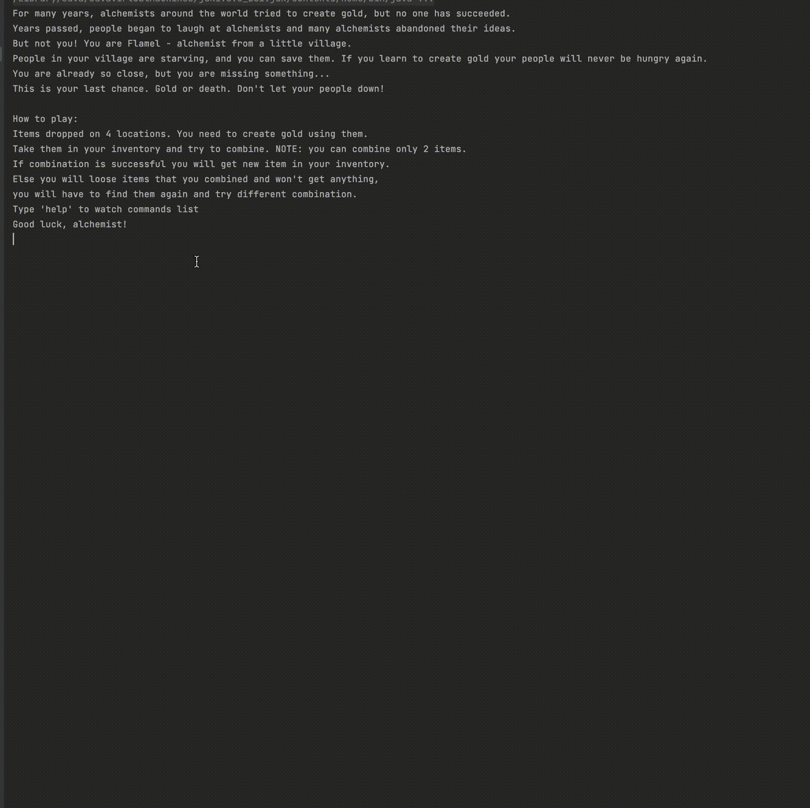
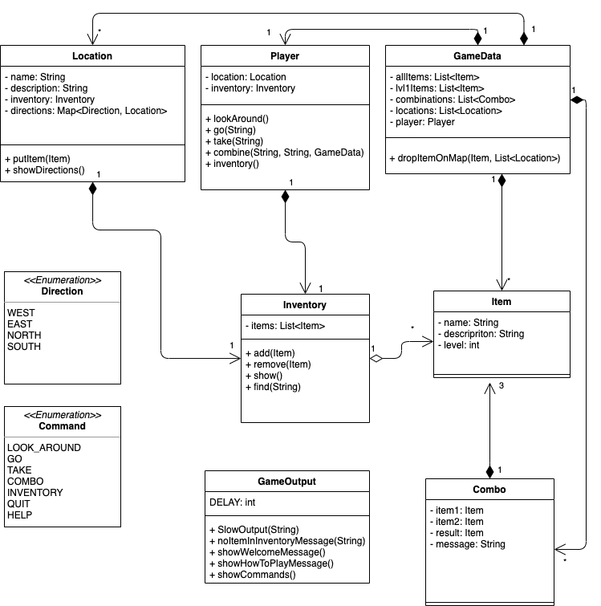

# Console text game "Alchemist"

[EN :us:](#EN)  
[RU :ru:](#RU)

### EN
## This project is about:
:small_blue_diamond: standard input/output  
:small_blue_diamond: streamAPI  
:small_blue_diamond: logging (log4j)  
:small_blue_diamond: testing (jUnit)  
:small_blue_diamond: Maven

### History :book:
Your character - alchemist Flamel from nameless country. People in your country starving without a harvest, 
and they have no money. They will die soon.  
Flamel, like all alchemists, tried to create the gold all his life. Now he is the only hope of saving his people. 
If Flamel create the gold, he will be able to feed the village.

### Gameplay :video_game:
Items dropped on 4 locations. You need to create gold using them.  
Take them in your inventory and try to combine. NOTE: you can combine only 2 items.  
If combination is successful you will get new item in your inventory.  
Else you will loose items that you combined and won't get anything, you will have to find them again and try different combination.  

Correct combinations will be generated randomly while game launch. This means remembering all combinations will 
not help you win again. You will have to try different combinations to guess correct.

### How to play :game_die:
Launch the game, after welcome message you can control your player. Use this commands:  
look - shows current location, items on this location, possible directions to go  
go [SOUTH/NORTH/WEST/EAST]- change location  
take [item] - take item in inventory  
inventory - shows items in your inventory  
combo [item1] [item2] - try to combine items  
quit - close game  

### Class diagram

### RU  
### Этот проект о:
:small_blue_diamond: потоки стандартного ввода/вывода  
:small_blue_diamond: streamAPI  
:small_blue_diamond: логирование (log4j)  
:small_blue_diamond: тестирование (jUnit)  
:small_blue_diamond: Maven

### Предыстория :book:
Ваш персонаж - алхимик по имени Фламель из безымянной деревни. Люди в вашей деревне голодают от отсутствия урожая, 
у них нет денег. Они скоро умрут.  
Фламель, как и все алхимики, пытался создать золото всю свою жизнь. Теперь он единственная надежда своей деревни. 
Если Фламель синтезирует золото, он сможет прокормить свою деревню.

### Геймплей :video_game:
Всего в игре 4 локации. На каждой локации разбросаны случайные предметы.  
Игрок может поместить предмет в свой инвентарь и попробовать скомбинировать 2 каких-то предмета в своем инвентаре.  
Некоторые комбинации предметов позволяют игроку получить новый предмет вместо комбинируемых, а другие комбинации 
не дадут игроку ничего, он просто потеряет комбинируемые предметы.  

Верные комбинации генерируются случайным образом при запуске игры. Если вы выиграете один раз и 
запомните все комбинации, это не поможет вам выиграть снова. Вам придется заново пытаться комбинировать разные предметы 
чтобы угадать верные комбинации.  

### Как играть :game_die:
Запустите игру. После приветственного сообщения вы можете начать управлять персонажем. Для этого вводите команды 
в консоль:  
look - вывести информацию о текущей локации, о предметах на ней и о локациях, в которые можно попасть из текущей
go [SOUTH/NORTH/WEST/EAST] - переместиться по указанному направлению в другую локацию
take [item] - положить предмет в инвентарь
inventory - показать предметы в инвентаре
combo [item1] [item2] - попытаться синтезировать новый предмет из двух (должны быть в инвентаре)
quit - выйти из игры

### Диаграмма классов

